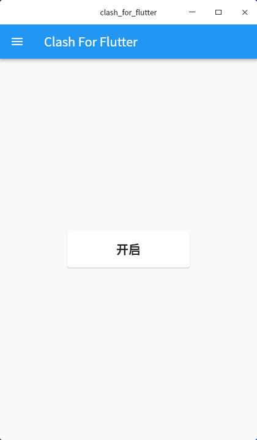

# clash_for_flutter

这是一个**Clash**的桌面客户端，支持 windows、linux、macos。

## 说明

- Linux
  linux 版本可能需要先安装`gtk3`和`libappindicator3`。对于 Debian 系的发行版可执行下面的命令：
  `sudo apt-get install gcc libgtk-3-dev libappindicator3-dev`

## 界面

界面较于简陋，不过这种应用也不用多炫吧

## 主要技术

- [Clash](https://github.com/Dreamacro/clash)
- [Flutter](https://flutter.dev)
- [Go-Flutter](https://github.com/go-flutter-desktop/go-flutter)
- [systray](https://github.com/getlantern/systray)
