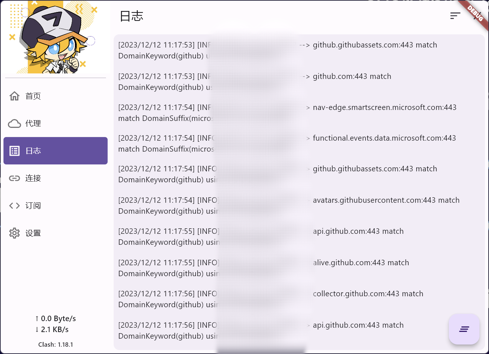
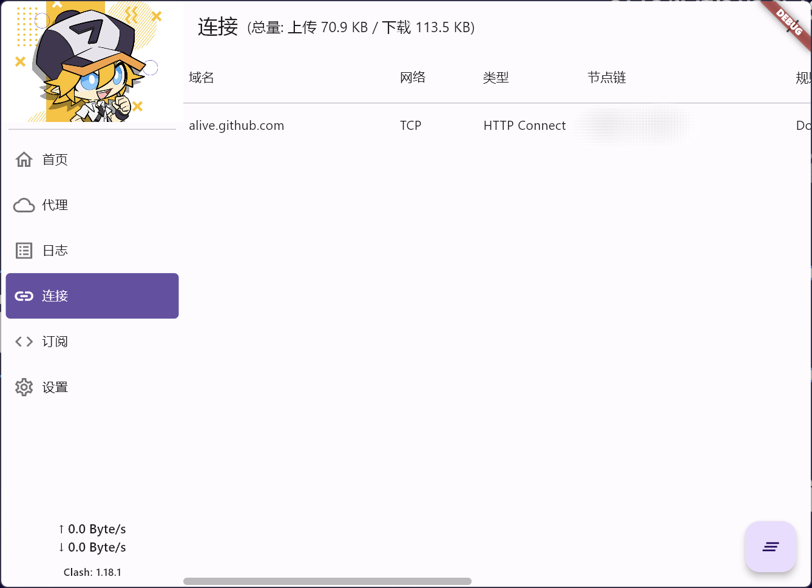

# Clash for Flutter

这是一个 **Clash** 的多平台客户端，支持 windows、linux、macos、android、~~ios~~。

> [使用说明](https://mapleafgo.github.io/clash-for-flutter)

## 界面







## 开发、打包说明

- 基础环境

  `Flutter v3.16+`

  > 对目标平台时，需要参照 Flutter 官方文档进行对应平台的环境搭建。如 Android 开发时，需要 Android-SDK

  > `Linux`环境下 [tray_manager](https://github.com/leanflutter/tray_manager) 需要 `libayatana-appindicator3-dev`

- 下载内核

  从 https://github.com/mapleafgo/cff-core/releases/latest 下载对应平台需要的内核，
  然后将解压出来的内核文件移动到对应的路径，各平台路径如下:

  ```shell
  # windows
  windows/core/libclash.dll
  # linux
  linux/core/libclash.so
  # android
  android/app/libs/libclash.aar
  # macos
  macos/Frameworks/libclash.dylib
  # ios
  ios/Frameworks/libclash.xcframework
  ```

  > 注意：解压出来的文件，仅保留所需的后缀名文件即可，且将其改名为路径的文件名

  > 内核是在 Clash v1.18.0 (非premium) 的基础上进行二次开发的，仅加入了 tun 模式（参照 Meta 进行）

- 编译项目

  ```shell
  # 1. 获取项目依赖
  $ flutter pub get
  # 2. 生成 .g.dart 文件
  $ dart run build_runner build --delete-conflicting-outputs

  # 3. 运行项目 (linux)
  $ flutter run -d linux
  # 3. 运行项目 (windows)
  $ flutter run -d windows
  # 3. 运行项目 (android)
  $ flutter run -d android
  # 3. 运行项目 (macos)
  $ flutter run -d macos
  ```

- 打包项目

  该项目用 [flutter_distributor](https://distributor.leanflutter.org/) 打包，打包步骤看 `flutter_distributor` 的官方文档吧

## 主要技术

- [Go](https://go.dev/)
- [Clash](https://github.com/Dreamacro/clash)
- [Flutter](https://flutter.dev)
- [tray_manager](https://github.com/leanflutter/tray_manager)
- [window_manager](https://github.com/leanflutter/window_manager)
- [proxy_manager](https://github.com/Kingtous/proxy_manager)
- [flutter_modular](https://github.com/Flutterando/modular)
- [dio](https://github.com/cfug/dio)
- [flutter_distributor](https://distributor.leanflutter.org/)

## 写在后面

自 1.0.0 版本开始，本软件全面从之前的 Go-Flutter 迁移到了官方 Flutter
版本。迁移中部分参考了 [Fclash](https://github.com/Kingtous/Fclash) 非常感谢！
