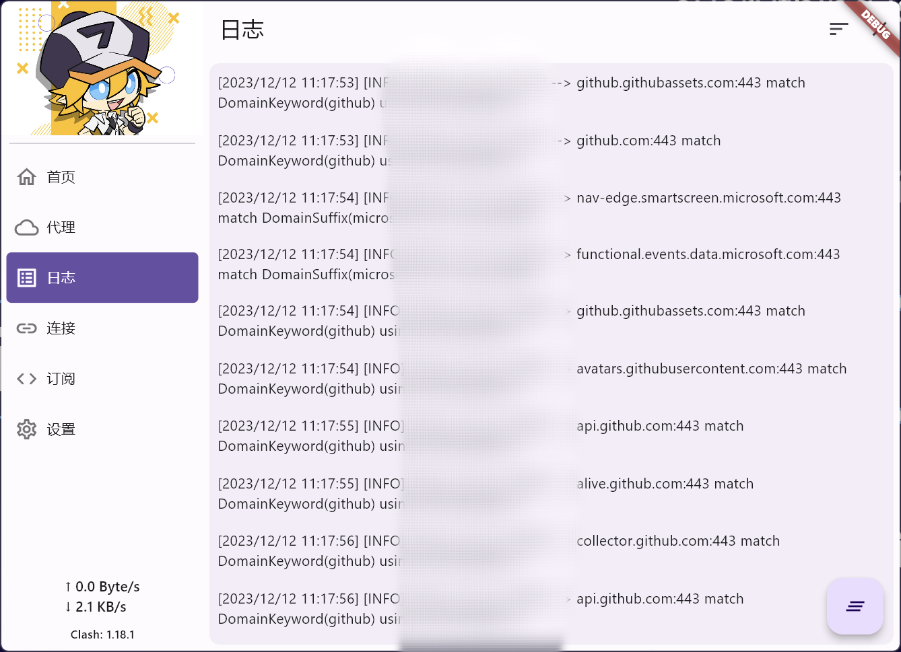
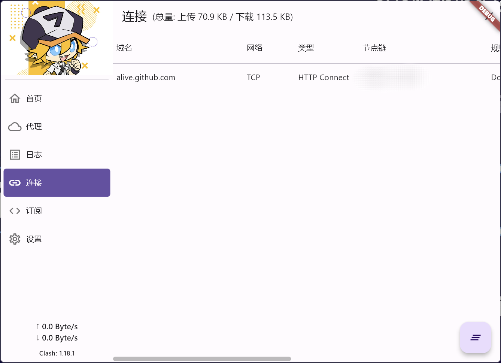

# Singcast

这是一个多平台代理客户端，支持 Windows、Linux、macOS、Android。

> [使用说明](https://mapleafgo.github.io/clash-for-flutter)

## 界面







## 开发说明

- 基础环境

  `Flutter v3.41+`

  > 对目标平台时，需要参照 Flutter 官方文档进行对应平台的环境搭建。如 Android 开发时，需要 Android-SDK

  > `Linux` 环境下需要 `libayatana-appindicator3-dev`

- 下载内核

  从 https://github.com/mapleafgo/cff-core/releases/latest 下载对应平台需要的内核，
  然后将解压出来的内核文件移动到对应的路径，各平台路径如下:

  ```shell
  # Windows
  windows/core/libsingcast-windows.dll
  # Linux
  linux/core/libsingcast-linux.so
  # Android
  android/app/libs/libsingcast.aar
  # macOS
  macos/Frameworks/libsingcast-darwin.dylib
  ```

  > 内核基于 sing-box 进行二次开发，支持 TUN 模式和代理模式

- 编译项目

  ```shell
  # 1. 获取项目依赖
  flutter pub get
  # 2. 生成 .g.dart 文件
  dart run build_runner build --delete-conflicting-outputs

  # 3. 运行项目 (linux)
  flutter run -d linux
  # 3. 运行项目 (windows)
  flutter run -d windows
  # 3. 运行项目 (android)
  flutter run -d android
  # 3. 运行项目 (macos)
  flutter run -d macos
  ```

## 主要技术

- [sing-box](https://github.com/SagerNet/sing-box)
- [Flutter](https://flutter.dev)
- [signals_flutter](https://github.com/rodydavis/signals.dart)
- [window_manager](https://github.com/leanflutter/window_manager)
- [proxy_manager](https://github.com/Kingtous/proxy_manager)
- [dart_ffi](https://dart.dev/guides/libraries/c-interop)
