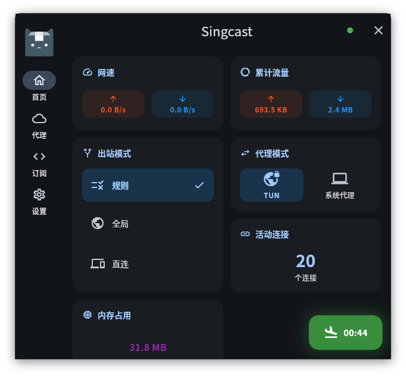

<div align="center">
  
  <h1>Singcast</h1>
  <p><strong>基于 sing-box 高性能内核的多平台代理客户端，支持 Clash 配置</strong></p>
</div>

<p align="center">
  <a href="README.md">English</a> | <a href="README_zh.md">中文</a>
</p>

基于 [sing-box](https://github.com/SagerNet/sing-box) 高性能内核的多平台代理客户端，通过 sing-box 支持 Clash 配置，简单易用。

支持 Windows、Linux、macOS、Android。

> [使用说明](https://mapleafgo.github.io/clash-for-flutter)

## 预览



## 功能

- 支持 Clash 订阅和配置文件
- 支持系统代理和 TUN 模式（全局透明代理）
- 代理节点选择与延迟测速
- 实时流量统计
- 订阅管理，支持导入和更新订阅链接
- 日志查看与导出
- 桌面端系统托盘

## 使用

### Linux

使用前请确保安装以下依赖

```bash
sudo apt-get install libayatana-appindicator3-dev
```

### 下载

[GitHub Releases](https://github.com/mapleafgo/clash-for-flutter/releases/latest)

## 构建

1. 安装 `Flutter v3.41+` 环境

   > 针对目标平台时，需要参照 Flutter 官方文档进行对应平台的环境搭建。如 Android 开发时，需要 Android SDK

2. 下载内核

   从 [cff-core Releases](https://github.com/mapleafgo/cff-core/releases/latest) 下载对应平台的内核，放置到以下路径：

   ```shell
   # 桌面端 (IPC 独立进程)
   windows/core/singcast-core.exe
   linux/core/singcast-core
   macos/Frameworks/singcast-core

   # 移动端 (FFI 原生库)
   android/app/libs/libsingcast.aar
   ios/Frameworks/libsingcast-darwin.xcframework
   ```

3. 编译运行

   ```shell
   # 获取依赖
   flutter pub get
   # 生成代码
   dart run build_runner build --delete-conflicting-outputs
   # 运行
   flutter run -d linux
   ```

## 主要技术

- [sing-box](https://github.com/SagerNet/sing-box)
- [Flutter](https://flutter.dev)
- [signals_flutter](https://github.com/rodydavis/signals.dart)
- [go_router](https://pub.dev/packages/go_router)
- [window_manager](https://github.com/leanflutter/window_manager)
- [desktop_tray](https://pub.dev/packages/desktop_tray)
- [dart_ipc](https://pub.dev/packages/dart_ipc)
- [ffi](https://dart.dev/guides/libraries/c-interop)
