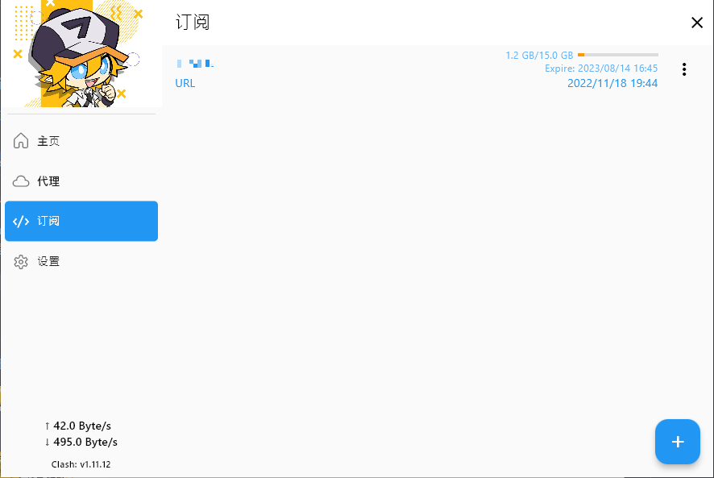
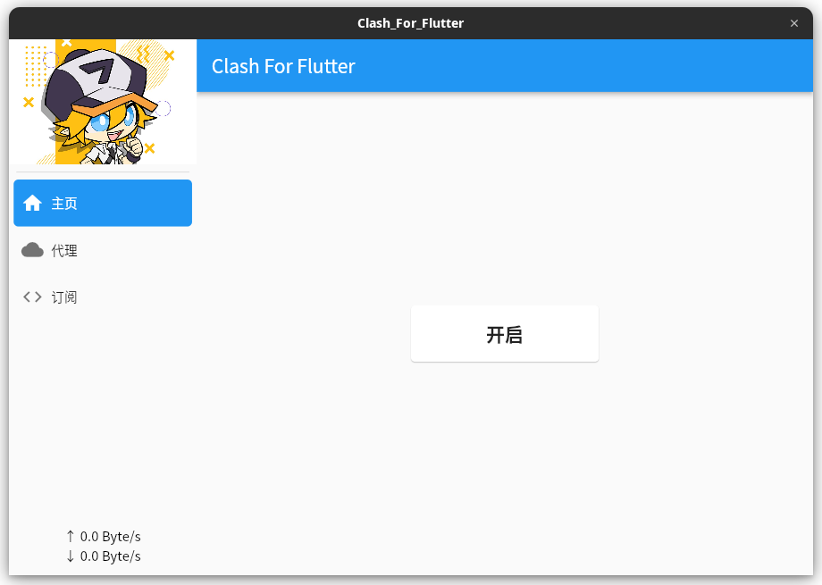
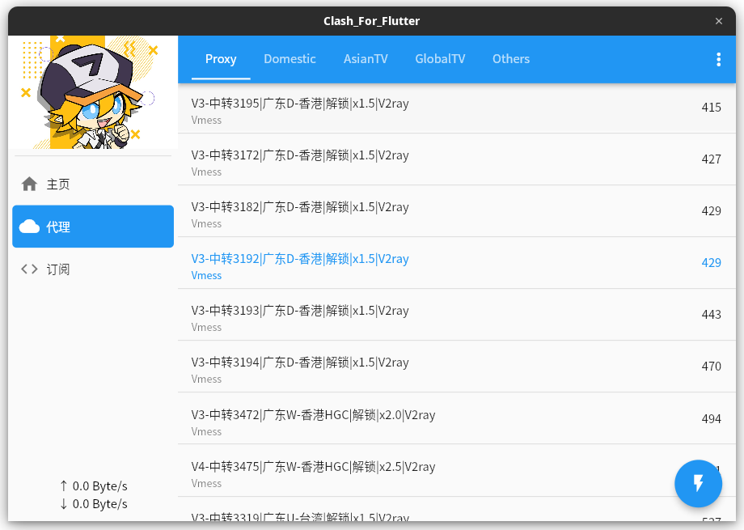
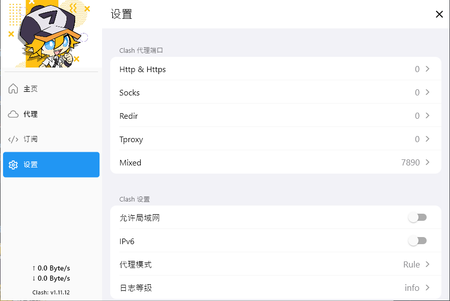

# Clash for Flutter

> 该软件是 Clash 的多平台端实现，使用[Flutter](https://flutter.dev/)开发。支持 Windows、Linux、MacOS、Android、~~IOS~~

### 下载

当前下载页面都只提供了 64 位的安装包[releases](https://github.com/mapleafgo/clash-for-flutter/releases/latest)
，由于当前是我自己手动在各个平台打包，所以做不到每个版本都提供的了安装包

- Linux:

  linux 安装包目前打包的为`appimage`的，这种包各个发行版都能直接使用

- Windows:

  windows 提供的是`msi`包

- MacOS:

  macos 提供的是`dmg`包

### 开始使用

该软件目前主要操作就三个，订阅、开启代理、切换代理节点。如下

- #### 订阅

  订阅页可以说是一切的源头，因为所有的代理节点地址都得通过订阅获取。

  

  这是已有订阅的界面，**在没有订阅或未选择订阅时是无法开启代理的**，添加订阅只需点击右下角的`+`
  按钮。在弹出的窗口中输入订阅地址或选择本地文件

  > 需要说明的是，当前**暂时不未支持自动更新订阅**，需手动在此页更新订阅

- #### 开启代理

  在已选择订阅的情况下，只需在本页点击开启即可。

  

  > 当前代理使用的是 PAC 自动设置代理的方式，在各平台通用。这种方式有一定的局限性，因为不是所有程序都会走代理，浏览器是没问题

- #### 切换代理节点

  

  此页就是最常用的页面了，经常使用的 **切换节点、测延迟(右下角按钮)** 都在此页。

  可能很多人对页面头的几个列表有疑问，这个的话，是订阅配置带过来的。是 Clash 的代理组，它是与规则搭配使用，可以做到对每个
  IP、每个地址进行代理配置，具体可查看[Clash 的文档](https://github.com/Dreamacro/clash/wiki/configuration#proxy-groups)
  。这个功能我们软件当前不负责维护，只提供基本的节点切换

- #### 设置

  

  设置页主要提供切换端口、和几个 Clash 的设置，后期可能会加入软件的一些功能

  - 代理端口
  
    对于代理端口，默认为 7890 (设置为 0 表示不开启)
  
    至于 Redir 和 Tproxy 的代理，目前我没用到过，都是默认为 0 的状态，这里就引入 Clash 官方的话来解释这两个吧
    ```yaml
    # Transparent proxy server port for Linux and macOS (Redirect TCP and TProxy UDP)
    redir-port: 7892
    
    # Transparent proxy server port for Linux (TProxy TCP and TProxy UDP)
    tproxy-port: 7893
    ```

  - 允许局域网访问

    这个可以让服务暴露在局域网中，局域网中的其它设备可以接入当前的代理

  - IPv6

    开启 IPv6 的支持

  ```yaml
  # 代理模式
  # rule: rule-based packet routing
  # global: all packets will be forwarded to a single endpoint
  # direct: directly forward the packets to the Internet
  mode: rule
  
  # 输出日志等级
  # info / warning / error / debug / silent
  log-level: info
  ```
