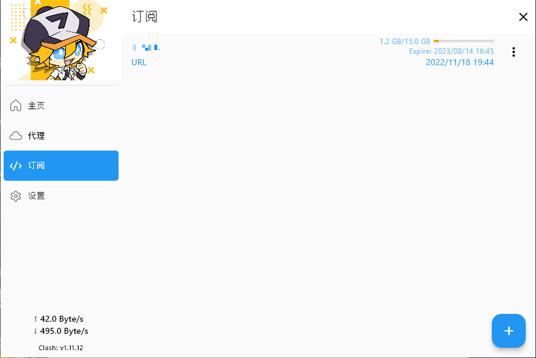
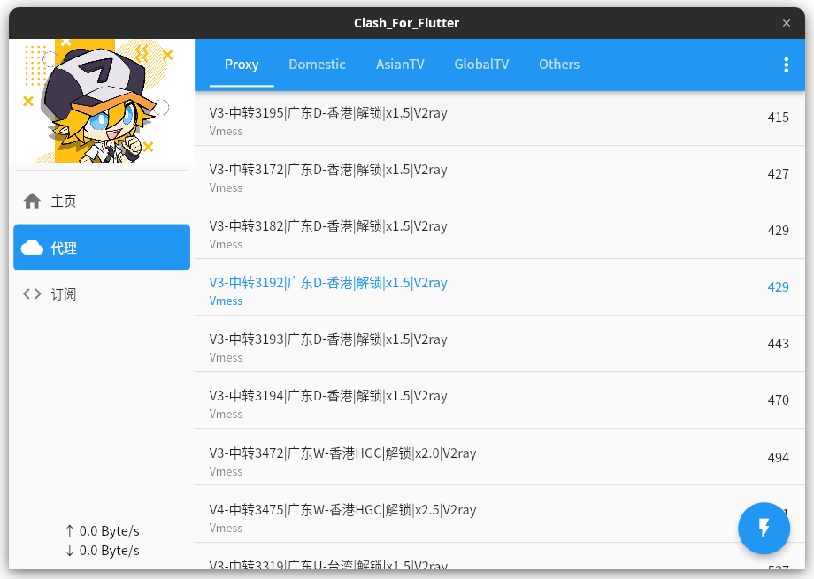
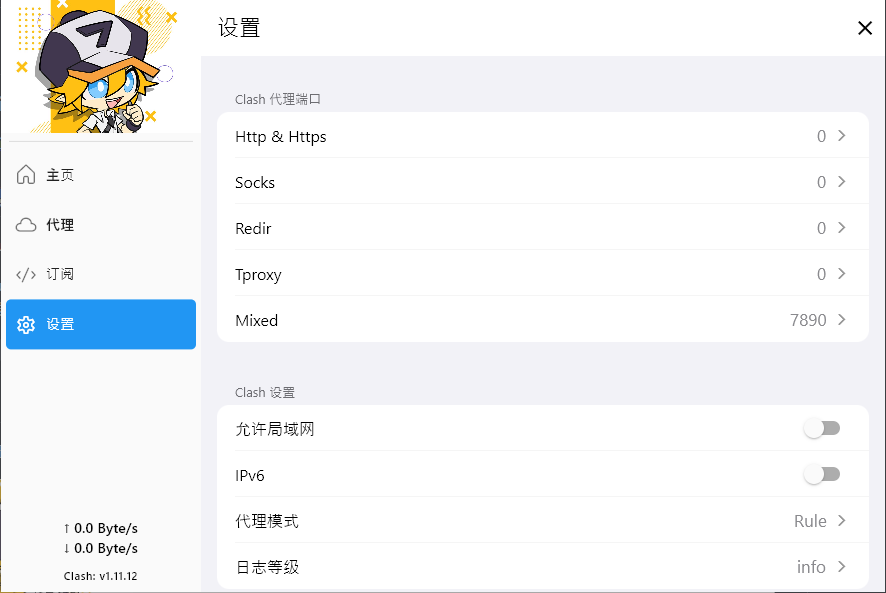

# Singcast 使用说明

> Singcast 是一款基于 Flutter 开发的多平台代理客户端，使用定制版 [sing-box](https://github.com/SagerNet/sing-box) 内核，支持 Clash 订阅链接和配置文件。

支持 **Windows**、**Linux**、**macOS** 和 **Android**。

## 下载

前往 [GitHub Releases](https://github.com/mapleafgo/singcast/releases/latest) 下载最新版本。所有安装包均为 64 位。

| 平台 | 格式 | 说明 |
|------|------|------|
| Windows | `.exe` (Inno Setup) | 安装版，支持便携模式 |
| Linux | `.AppImage` | 免安装，各发行版通用 |
| macOS | `.dmg` | 拖入 Applications 即可 |
| Android | `.apk` | arm64 / x86_64 |

> Linux 使用前需安装系统托盘依赖：`sudo apt-get install libayatana-appindicator3`

## 快速上手

### 1. 添加订阅

订阅是获取代理节点的前提。进入**订阅页**，点击右下角 `+` 按钮，在弹出的窗口中输入订阅地址或选择本地 Clash 配置文件。

添加后点击订阅条目即可选中并更新节点。**必须选中一个订阅后才能开启代理**。

### 2. 开启代理

回到**主页**，开启代理总开关。默认使用系统代理模式，桌面端可切换为 TUN 模式实现透明代理。

- **系统代理**：设置系统 HTTP/SOCKS5 代理，浏览器和大部分应用自动生效
- **TUN 模式**：创建虚拟网卡接管全局流量，所有应用均走代理，无需逐个配置

### 3. 切换节点

进入**代理页**，页面顶部列出订阅配置中的代理组（如"节点选择"、"自动选择"等），点击组内节点即可切换。右下角按钮可对当前组所有节点进行延迟测试。

## 设置

### 内核设置

| 选项 | 说明 |
|------|------|
| 代理服务 | 开启 HTTP/SOCKS5 混合代理端口 |
| 允许局域网 | 允许局域网内其他设备通过本机代理上网 |
| 端口号 | 代理服务监听的本地端口（默认 7890） |
| IPv6 | 代理连接支持 IPv6 网络协议 |
| 出站模式 | 规则 / 全局 / 直连，控制流量路由策略（仅桌面端） |
| Clash API | 对外提供代理状态查询和控制接口 |
| 日志等级 | 调试 / 信息 / 警告 / 错误，等级越低记录越详细 |

### 普通设置

| 选项 | 说明 |
|------|------|
| 订阅 User-Agent | 更新订阅时使用的 UA 标识 |
| 延迟测试 URL | 测速时请求的目标地址 |
| Rule-Set 代理 | 下载规则集时使用的代理地址 |

### 外观

| 选项 | 说明 |
|------|------|
| 主题 | 跟随系统 / 浅色 / 深色 |
